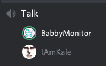

# Discord Baby Monitor 👾🤖🎤👶

A weekend project to test the feasibility of running a **Discord bot** on a **Raspberry Pi** that pipes microphone audio into a voice channel.

Conclusion: it works!


<br>
<sub>The green ring indicates a live mic from the bot!</sub>

This bot has been tested to work on both a **Raspberry Pi 2 Model B** running **Raspbian Stretch Lite** (Build 2019-04-08).

> NOTE: I initially developed this setup on a **2018 Macbook Pro** running **macOS Mojave** (10.14.5), and so there's a bit of platform-specific code in `getDefaultMicrophoneStream()` in **helpers/microphone.js**. That said, the instructions below should work for both use cases with minimal modification. I'll try to be clear when a particular platform requires special consideration.

The bot is written in JavaScript using the latest stable release (v11.5.1) of the [Discord.js API library](https://github.com/discordjs/discord.js).

> CAVEAT: This was born as a weekend project, and thus everything is provided as-is. While I've taken strides to deliver a Pretty Robust™ collection of code, I can't guarantee you won't run into any issues when you attempt to stand this up yourself!

## Requirements:

- Node v10.16.0
- USB microphone
    - An older **Blue Snowball** USB microphone was used on both platforms to great effect. I want to believe that whatever USB microphone you have on-hand will work as well.

### On Raspbian Stretch Lite:

- FFMPEG

This can be installed via **apt**:

```sh
$> sudo apt install ffmpeg
```

### On **macOS**:

- SoX v14.4.2
- FFMPEG v4.1.3

These can be installed via **Homebrew**:

```sh
$> brew install sox ffmpeg
```

Afterwards you'll need to set the USB microphone as the "device for sound import" from within the **Sound** preference panel to allow SoX' `arecord` utility (used under the hood) to use it.

## Environment variables

The bot requires a **.env** file to be placed in the root project directory with the following variables:

- `BOT_TOKEN`: A Discord API access token for the bot
- `BOT_PREFIX`: The prefix character to require in front of the bot's commands.
    - This is typically something like an `!` (`BOT_PREFIX=!`).
- `ARECORD_DEVICE_ID` (**Raspbian only**): A string in the following format: `hw:<cardID>:<deviceID>`.
    - The two ID's can be retrieved via ALSA's `arecord -l` command.
    - You _may_ omit the `:<deviceID>` part of the string if the microphone displays a single device ID.
    - The bot will default to using the first available input device if this environment variable is not specified.

## Running the bot

Install dependencies via NPM:

```sh
$> npm install
```

Then, start the bot:

```sh
$> npm run start:prod
```

You can also start the bot in "development" mode so that it restarts whenever changes are made to its source code:

```sh
$> npm start
```

## Controlling the bot in Discord

1. **Join the bot to your Discord guild** with the following URL, replacing "BOT_CLIENT_ID_HERE" with a proper Discord Application Bot client ID:

https://discordapp.com/oauth2/authorize?&client_id=BOT_CLIENT_ID_HERE&scope=bot&permissions=3214592

The `permissions` query param specified in the URL above should request the following Discord guild permissions:

- **Text Permissions**
    - Read Messages
    - Read Message History
    - Send Messages
- **Voice Permissions**
    - View Channel
    - Connect
    - Speak
    - Priority Speaker

> NOTE: In my testing, these were sufficient to enable all intended functionality. Additional testing may reveal the possibility of reducing this list of permissions even further.

2. From within your Discord guild, **join a Voice Channel**.
3. In a Text Channel the bot can access, **type `!bmonitor`**. The bot should join your Voice Channel and begin streaming audio from the microphone:
4. When you want to stop the monitor, **type `!bstop`**. The bot will stop streaming the microphone audio and then disconnect from the Voice Channel.
    - The bot has also been configured to **automatically leave a Voice Channel when the user who invoked `!bmonitor` leaves that Voice Channel**! This is intended to help fathers quickly stop streaming via a typical Discord user interaction.
